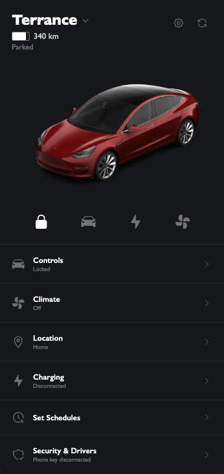
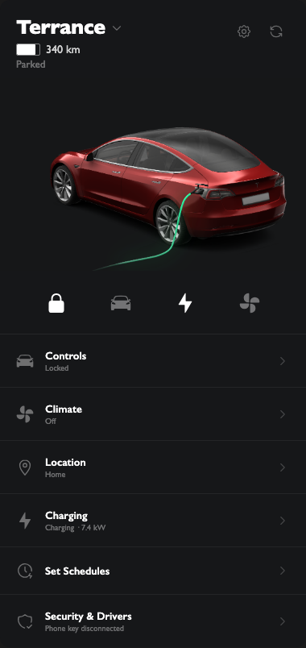
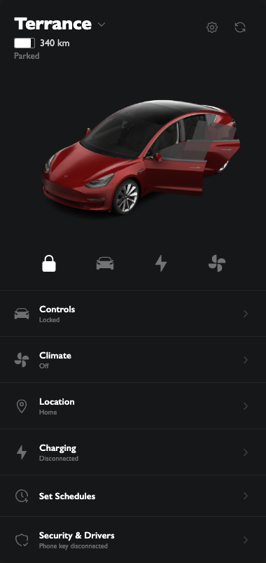
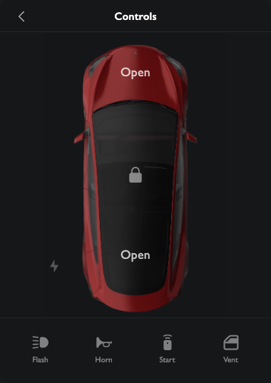
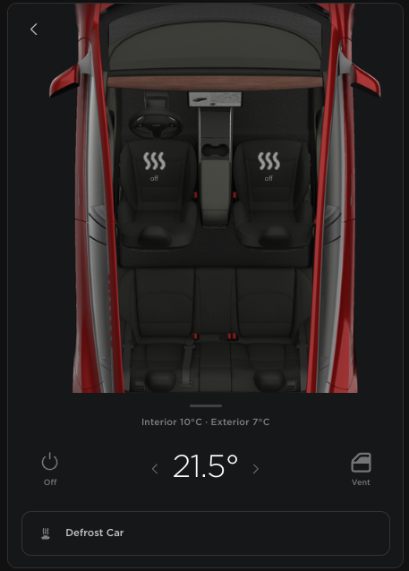
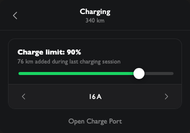
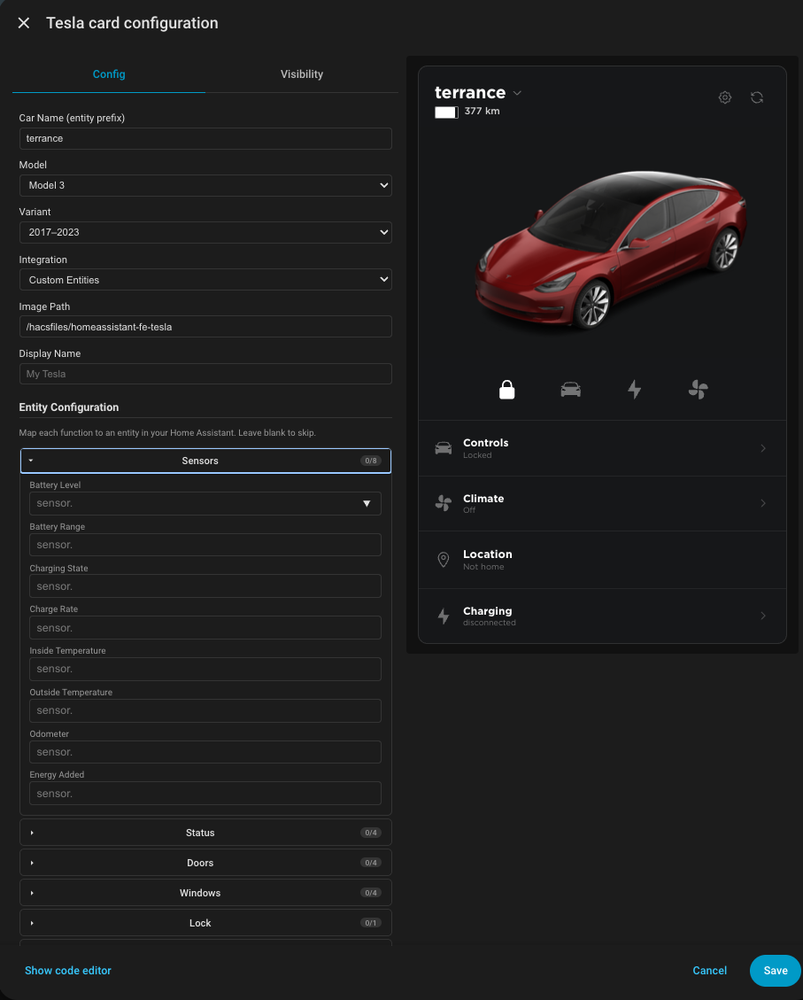

# Tesla Card for Home Assistant

A custom Lovelace card for Tesla vehicles in Home Assistant. Supports the **official [Tesla Fleet](https://www.home-assistant.io/integrations/tesla_fleet/)** integration, the **[alandtse/tesla](https://github.com/alandtse/tesla)** custom integration, and **fully custom entity mapping** for MQTT or any other integration. Control your Tesla directly from your dashboard with a clean, app-style interface.

[](https://my.home-assistant.io/redirect/hacs_repository/?owner=ds2000&repository=homeassistant-fe-tesla&category=plugin)

If you find this card useful: [](https://www.buymeacoffee.com/daveshaw301)

| Landing | Charging | Doors Open |
|---------|----------|-----------|
|  |  |  |

| Controls | Climate | Charger |
|----------|---------|---------|
|  |  |  |

---

## Features

- **Real-time car visualization** — overlay-based rendering composites door, trunk, frunk, and chargeport states in real time (128 offcharge + 64 oncharge combinations)
- **On-charge mode** — automatically switches to charging images when plugged in, with an animated green glow on the charging cable
- **Default view** — car image with battery bar, range, parked/speed status, inside temperature
- **Charger menu** — charging state, charge port open/close, start/stop charging, charge limit slider, charging amps slider
- **Climate menu** — HVAC on/off, temperature stepper, defrost toggle, heated front seats (Off/Low/Med/High), heated steering wheel (Auto/Low/High), camp mode, dog mode, cabin overheat protection, window vent/close
- **Controls menu** — door lock/unlock, frunk open, trunk open/close, charge port, remote start, horn, flash lights, window vent/close, tyre pressure display (psi/bar toggle)
- **Driving mode** — speed display, wind line animation, navigation row with destination and arrival time
- **Charging header** — green battery bar, bolt icon, range in green, time remaining to charge limit
- **Animated climate indicator** — spinning fan icon on landing page when HVAC is active
- **Custom entity mapping** — use any HA entities (MQTT, third-party integrations) via the built-in entity picker
- **Landscape layout** — optional wide layout with side-by-side panels
- **Smart refresh** — wake button wakes the car and forces HA to re-poll all entities
- **Multiple models & colours** — Model 3, Y, S, X with community-contributed colour variants

**No helper entities required.** Menu state is managed entirely inside the card.

**No card dependencies required.** Single self-contained JS file.

### Roadmap

- Wheel spin animation when driving
- More factory colours for all models
- Additional car models and variants

Help us grow the image library — submit your car's screenshots via the [Image Uploader](https://ds2000.github.io/homeassistant-fe-tesla-image-uploader) (beta).

---

## Installation

### Via HACS (recommended)

[](https://my.home-assistant.io/redirect/hacs_repository/?owner=ds2000&repository=homeassistant-fe-tesla&category=plugin)

Or manually: open HACS, click **Frontend** > **+**, search for **Tesla Card**, and install.

### Manual

1. Download `dist/tesla-card.js` from this repository
2. Copy it to `/config/www/tesla-card.js` on your HA instance
3. Go to **Settings > Dashboards > Resources** and add:
   ```
   URL:  /local/tesla-card.js
   Type: JavaScript module
   ```
4. Reload your browser

---

## Prerequisites

1. A working [Home Assistant](https://www.home-assistant.io/) installation
2. One of:
   - The official [Tesla Fleet](https://www.home-assistant.io/integrations/tesla_fleet/) integration (default), or
   - The [alandtse/tesla](https://github.com/alandtse/tesla) custom integration, or
   - Any integration providing Tesla-like entities (MQTT, custom bridge, etc.) — use Custom Entities mode

---

## Configuration

Add the card to your dashboard via the UI editor, or paste into the YAML editor:

```yaml
type: custom:tesla-card
car_name: my_tesla
```

### All options

| Option | Required | Default | Description |
|--------|----------|---------|-------------|
| `car_name` | **Yes**\* | -- | Entity prefix for your car (e.g. `my_tesla` for `sensor.my_tesla_battery_level`) |
| `integration` | No | `fleet` | `fleet` — Official Tesla Fleet integration · `custom` — alandtse/tesla integration · `entities` — Manual entity mapping |
| `entity_overrides` | No | -- | Map of entity keys to custom entity IDs (used with `integration: entities`) |
| `car_model` | No | `3` | Model number: `3`, `Y`, `S`, or `X` |
| `car_color` | No | `red_multi_coat` | Colour ID matching the image folder name |
| `image_path` | No | `/hacsfiles/homeassistant-fe-tesla` | Base path where car images are stored |
| `name` | No | _(car_name)_ | Display name shown at the top of the card |
| `show_speed` | No | `true` | Show the Parked / speed status column |

### Full example

```yaml
type: custom:tesla-card
car_name: my_tesla
integration: fleet
car_model: "3"
car_color: red_multi_coat
name: My Tesla
show_speed: true
```

### Visual editor

The card includes a built-in GUI editor. Click the pencil icon on the card in the Lovelace UI to configure all options without writing YAML.

### Custom entity mapping

If your entities don't follow the standard Tesla Fleet or alandtse naming convention (e.g. you use MQTT, a third-party bridge, or have renamed entities), select **Custom Entities** as the integration and map each entity individually using the visual editor:



Or configure via YAML:

```yaml
type: custom:tesla-card
car_name: my_tesla
integration: entities
entity_overrides:
  BATTERY_LEVEL: sensor.my_battery
  BATTERY_RANGE: sensor.my_range
  CLIMATE: climate.my_hvac
  DOOR_LOCK: lock.my_front_door
```

Only override the entities you need; the rest will be skipped.

> **Note:** Custom entity mapping is an advanced, untested feature. It should work with any HA entity that follows standard domain conventions (lock, climate, cover, switch, sensor, etc.) but has not been validated against all third-party integrations. Please report any issues.

\* `car_name` is optional when using `integration: entities`.

---

## Entity Reference

All entity IDs are derived from your `car_name` value automatically. The card maps to the correct entity names based on the `integration` setting.

<details>
<summary><strong>Tesla Fleet (official) entities</strong></summary>

| Entity | Used for |
|--------|----------|
| `sensor.{car_name}_battery_level` | Battery percentage |
| `sensor.{car_name}_battery_range` | Remaining range |
| `sensor.{car_name}_charging` | Charging state label |
| `sensor.{car_name}_charge_rate` | Current charge rate |
| `sensor.{car_name}_inside_temperature` | Cabin temperature |
| `lock.{car_name}_lock` | Door lock/unlock |
| `climate.{car_name}_climate` | HVAC on/off, target temperature, camp/dog mode presets |
| `cover.{car_name}_charge_port_door` | Open/close charge port |
| `cover.{car_name}_froot` | Open frunk |
| `cover.{car_name}_boot` | Open/close trunk |
| `cover.{car_name}_vent_windows` | Vent/close windows |
| `number.{car_name}_charge_limit` | Charge limit slider |
| `number.{car_name}_charge_current` | Charging amps slider |
| `switch.{car_name}_sentry_mode` | Sentry mode toggle |
| `switch.{car_name}_defrost` | Defrost toggle |
| `climate.{car_name}_cabin_overheat_protection` | Cabin overheat protection |
| `select.{car_name}_seat_heater_front_left` | Left seat heat level |
| `select.{car_name}_seat_heater_front_right` | Right seat heat level |
| `button.{car_name}_honk_horn` | Honk horn |
| `button.{car_name}_flash_lights` | Flash lights |
| `button.{car_name}_keyless_driving` | Remote start |
| `button.{car_name}_wake` | Force data update |

</details>

<details>
<summary><strong>Tesla Custom (alandtse) entities</strong></summary>

| Entity | Used for |
|--------|----------|
| `sensor.{car_name}_battery` | Battery percentage |
| `sensor.{car_name}_battery_range` | Remaining range |
| `sensor.{car_name}_charging_state` | Charging state label |
| `sensor.{car_name}_charge_rate` | Current charge rate |
| `sensor.{car_name}_temperature_inside` | Cabin temperature |
| `lock.{car_name}_doors` | Door lock/unlock |
| `climate.{car_name}_hvac_climate_system` | HVAC on/off, target temperature |
| `button.{car_name}_charge_port_open` | Open charge port |
| `button.{car_name}_charge_port_close` | Close charge port |
| `button.{car_name}_frunk` | Open frunk |
| `button.{car_name}_trunk` | Open/close trunk |
| `cover.{car_name}_windows` | Vent/close windows |
| `number.{car_name}_charge_limit` | Charge limit slider |
| `number.{car_name}_charging_amps` | Charging amps slider |
| `switch.{car_name}_sentry_mode` | Sentry mode toggle |
| `switch.{car_name}_defrost` | Defrost toggle |
| `select.{car_name}_cabin_overheat_protection` | Cabin overheat protection |
| `select.{car_name}_heated_seat_left` | Left seat heat level |
| `select.{car_name}_heated_seat_right` | Right seat heat level |
| `button.{car_name}_horn` | Honk horn |
| `button.{car_name}_flash_lights` | Flash lights |
| `button.{car_name}_remote_start` | Remote start |
| `button.{car_name}_force_data_update` | Force data update |

</details>

Not all entities need to exist — the card silently skips any that are unavailable.

---

## Contributing

All contributions are welcome:

- **New car images** — submit via the [Image Uploader](https://ds2000.github.io/homeassistant-fe-tesla-image-uploader) (beta), or manually add a folder under `images/models/{model}/{variant}/{colour}/`
- **Bug reports** -- open an issue with your HA version, integration version, and what you expected vs what happened
- **Pull requests** -- please follow the one-feature-at-a-time rule and test against a live HA instance before submitting

### Image Contributors

| Contributor | Submission |
|-------------|------------|
| David Shaw | Model 3 2017–2023 — Red Multi-Coat |
| [@ccarcione](https://github.com/ccarcione) | Model 3 2017–2023 — Deep Blue Metallic |
| [@ccarcione](https://github.com/ccarcione) | Model Y 2020–2024 — Deep Blue Metallic |
<!-- END_CONTRIBUTORS -->

---

## Development

```bash
# Install dev dependencies
npm install

# Build dist/tesla-card.js
npm run build

# Watch for changes (with inline sourcemaps)
npm run watch

# Run tests
npm test

# Run tests in watch mode
npm run test:watch
```

Source files are in `src/`. The compiled output is `dist/tesla-card.js`. Tests are in `tests/`.
